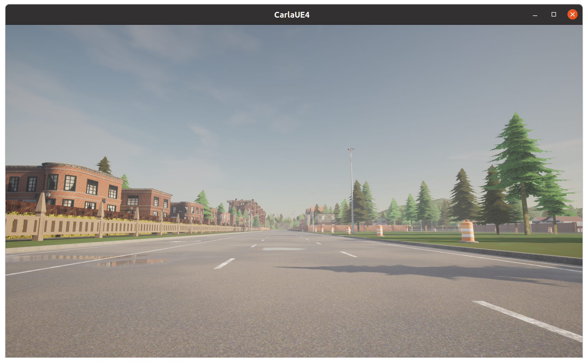

# OpenCDA

Lab slides: https://docs.google.com/presentation/d/1Ze8WRpf5-9L_m19j-S660coGTrfBazEC/edit?usp=sharing&ouid=106838674837148912002&rtpof=true&sd=true

## How to use 

- Git clone CEE298-2024Spring repository:

  ```
  git clone https://github.com/ucla-mobility/CEE298-2024Spring.git
  # get into CEE298-2024Spring directory
  cd CEE298-2024Spring
  ```

- Checkout `lab2_opencda` branch:

  ```
  git checkout lab2_opencda
  # get into lab02_opencda
  cd lab02_opencda
  ```

- Activate `opencda` environment in Terminal_1

  ```
  conda activate opencda
  ```

- Launch CARLA in another terminal Terminal_2

  ```
  ./CarlaUE4.sh
  ```

- Change to Town06 in Terminal_1:

  ```
  cd /your/path/to/CARLA_0.9.12/PythonAPI/util
  python ./config.py --map Town06
  ```

- In CARLA simulator, use mouse and keyboard to select a traffic road and run the `get_spectator_pos.py` in Terminal_1:

  This is the spectator position you selected:
  
  

  ```
  python get_spectator_pos.py
  ```
  
  - After code is finished running, you should get a spectator position looks like this:
  
    ```
    Carla/Maps/Town06
    Transform(Location(x=5.742236, y=36.638737, z=7.522086), Rotation(pitch=-21.207668, yaw=89.216728, roll=-0.000397))
    ```
  
  

